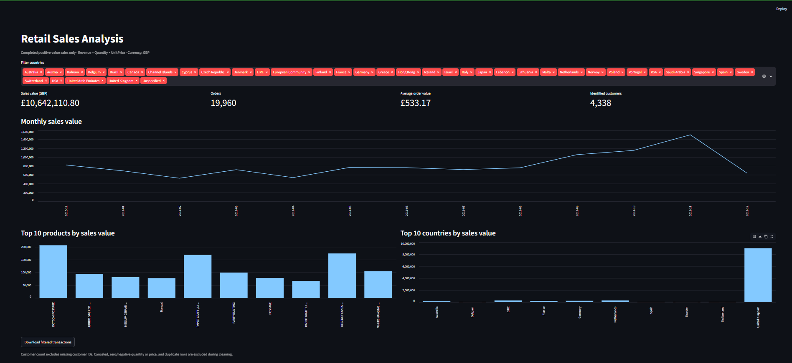

# Retail Sales Analysis

An end-to-end portfolio project using Python, SQLite, and Streamlit to explore completed sales in the UCI Online Retail dataset.

## Business questions

- How do sales value and order counts change each month?
- Which products and countries contribute the most sales value?
- What is the average order value?
- How many identified customers placed more than one order?

## Dataset

Download **Online Retail** from the [UCI Machine Learning Repository](https://archive.ics.uci.edu/dataset/352/online+retail) and save the spreadsheet as `data/Online_Retail.xlsx`. It records UK online retail transactions from December 2010 through December 2011. Cite the dataset when publishing findings; see its repository page for attribution and license details. The data is not committed to GitHub.

## Run locally

```bash
python -m venv .venv
# Windows PowerShell: .venv\Scripts\Activate.ps1
# macOS/Linux: source .venv/bin/activate
pip install -r requirements.txt
python src/prepare.py data/Online_Retail.xlsx
python src/analysis.py
streamlit run app.py
```

The cleaning script creates `output/retail.db` and `output/cleaning_summary.json`. The analysis script saves five reports under `output/reports/`. To use a CSV export instead, run `python src/prepare.py data/Online_Retail.csv`.

## Method

1. Read the raw XLSX or CSV file and check its expected columns.
2. Exclude cancellation invoices (starting with `C`), missing invoice numbers or dates, nonpositive quantities/prices, and duplicate rows. Missing customer IDs remain in overall sales and order counts, but do not count as identified customers.
3. Calculate `Revenue = Quantity × UnitPrice` in pounds. This is a **gross sales value for the retained rows**, not profit, tax-adjusted revenue, or a net returns figure.
4. Load the cleaned records into SQLite, run saved SQL queries, and explore them in the dashboard.

## Results

- **Rows retained:** 524,878 of 541,909 transaction rows after cleaning.
- **Highest sales month:** November 2011, with £1,503,866.78 in sales value across 2,769 orders.
- **Highest-value named product:** REGENCY CAKESTAND 3 TIER, with £174,156.54 in sales value.
- **Observation:** Sales value rose in September, October, and November 2011. December 2011 covers only part of the month.

